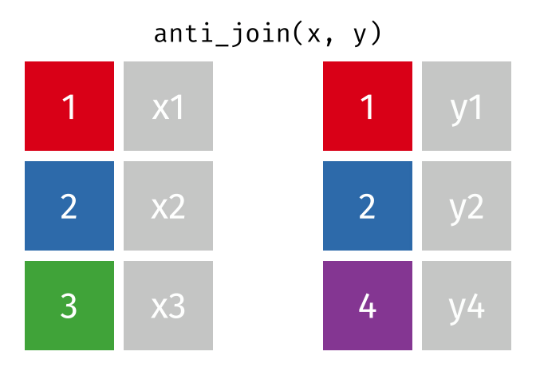

```{r setup, include = FALSE}
knitr::opts_chunk$set(fig.width = 6, fig.height = 4, message = FALSE,
                      warning = FALSE, comment = "", cache = FALSE)
library(flipbookr)
library(tidyverse)
theme_set(theme_minimal(base_size = 14))
options(pillar.print_max = 8, pillar.print_min = 8, width = 70)
```

```{r xaringan-themer, include = FALSE, warning = FALSE}
library(xaringanthemer)
library(xaringanExtra)

style_mono_accent(base_color = "#3467B0", black_color = "2F3D91",
                  title_slide_background_image = "img/imageedit_1_9320575936.png",
                  background_image = "img/imageedit_1_9320575936.png",
                  title_slide_background_color = "#FFFF",
                  title_slide_text_color = "#2F3D91")
```

```{r xaringan-logo, echo = FALSE}
xaringanExtra::use_logo(
  image_url = "img/trans_logo.png",
  position = css_position(left = "1em", top = "1em")
)
```

```{r load-data, include = FALSE}
flights        <- read_csv("data/flights.csv")
airlines       <- read_csv("data/airlines.csv")
gapminder_wide <- read_csv("data/gapminder.csv")
riskfactors    <- read_csv("data/riskfactors.csv")
```

## أجندة اليوم (8 ساعات)

| الوقت | الوحدة | الموضوع |
|:------|:-------|:--------|
| 09:00 – 09:30 | الافتتاح | لماذا tidyverse؟ الأنبوب، tibble، سير العمل |
| 09:30 – 10:30 | الوحدة 1 | قراءة البيانات والأفعال الأساسية في dplyr |
| 10:30 – 10:45 | استراحة | |
| 10:45 – 12:00 | الوحدة 2 | dplyr المتقدم: `across` و `.by` ودوال النوافذ |
| 12:00 – 13:00 | غداء | |
| 13:00 – 14:00 | الوحدة 3 | تنظيم البيانات باستخدام tidyr |
| 14:00 – 14:45 | الوحدة 4 | ربط الجداول: المفاتيح و `join_by` |
| 14:45 – 15:00 | استراحة | |
| 15:00 – 15:45 | الوحدة 5 | النصوص والعوامل والتواريخ |
| 15:45 – 16:30 | الوحدة 6 | التكرار والدوال باستخدام purrr |
| 16:30 – 17:00 | الختام | مشروع ختامي ومراجعة |

---

## أهداف الدورة

بنهاية اليوم يستطيع المتدرب أن:

* يقرأ البيانات بشكل صحيح ويتحكم في أنواع الأعمدة باستخدام `readr`.
* يبني سلاسل تحويل كاملة باستخدام أفعال `dplyr` بما فيها `across()` و `.by`.
* يستخدم دوال النوافذ (`lag`, `cumsum`, `min_rank`) داخل المجموعات.
* يحول البيانات بين الشكل الطويل والعريض ويعالج القيم الناقصة ضمنياً.
* يربط الجداول بأمان ويتحقق من المفاتيح ويستخدم الربط بالشروط.
* ينظف النصوص والعوامل والتواريخ باستخدام `stringr` و `forcats` و `lubridate`.
* يكرر العمليات ويكتب دوال قابلة لإعادة الاستخدام باستخدام `purrr` و tidy evaluation.

--

.red[
الدورة عملية: كل وحدة تنتهي بتمرين مؤقت ينفذه المتدرب على جهازه.
]

---

## المتطلبات

.pull-right[

* R إصدار 4.1 أو أحدث و RStudio.
* حزمة tidyverse إصدار 2.0 أو أحدث:

```{r, eval = FALSE}
install.packages("tidyverse")
library(tidyverse)
tidyverse_packages()
```

* مجلد `data` المرفق مع الدورة.
* ملف التمارين: `exercises/tidyverse_one_day_exercises.Rmd`

]

.pull-left[

| الملف | الوصف |
|:------|:------|
| `flights.csv` | 336,776 رحلة من مطارات نيويورك 2013 |
| `airlines.csv` | رموز وأسماء شركات الطيران |
| `gapminder.csv` | بيانات دول بالشكل العريض |
| `riskfactors.csv` | مسح صحي به قيم مفقودة |

]

---

class: inverse, center, middle

# الافتتاح

## لماذا tidyverse؟

---

## ما هو tidyverse؟

مجموعة حزم تشترك في فلسفة واحدة: **البيانات المنظمة + دوال بسيطة تتركب معاً**

.my-ltr[

| الحزمة | الوظيفة |
|:-------|:--------|
| `readr` | قراءة وكتابة الملفات النصية |
| `tibble` | إطار بيانات حديث |
| `dplyr` | تحويل البيانات |
| `tidyr` | تنظيم شكل البيانات |
| `stringr` / `forcats` / `lubridate` | النصوص / العوامل / التواريخ |
| `purrr` | البرمجة الوظيفية والتكرار |
| `ggplot2` | تصوير البيانات |

]

--

كل الدوال تأخذ إطار البيانات كأول معامل وتعيد إطار بيانات، وهذا ما يجعل الأنبوب ممكناً.

---

## الأنبوب: `%>%` و `|>`

.pull-right[

```{r, eval = FALSE}
# بدون أنبوب
arrange(
  summarise(
    group_by(flights, carrier),
    n = n()
  ),
  desc(n)
)
```

]

.pull-left[

```{r, eval = FALSE}
# مع الأنبوب
flights %>%
  group_by(carrier) %>%
  summarise(n = n()) %>%
  arrange(desc(n))
```

]

--

* `%>%` من حزمة magrittr (تأتي مع tidyverse).
* `|>` الأنبوب الأصلي في R منذ الإصدار 4.1، أسرع ولا يحتاج حزمة.
* الفرق العملي: مع `|>` استخدم `\(x)` بدلاً من `.` للإشارة للمعامل.
* في هذه الشرائح نستخدم `%>%` والنتيجة واحدة.

---

## tibble مقابل data.frame

```{r}
flights
```

--

* يطبع أول 10 صفوف فقط ويبين نوع كل عمود.
* لا يحول النصوص إلى عوامل ولا يغير أسماء الأعمدة.
* `glimpse()` لعرض سريع لكل الأعمدة.

---

class: inverse, center, middle

# الوحدة 1

## قراءة البيانات والأفعال الأساسية

### 09:30 – 10:30

---

## قراءة البيانات باستخدام `readr`

```{r read-basic}
flights <- read_csv("data/flights.csv")
```

--

`readr` يخمن نوع كل عمود من أول 1000 صف. تحقق دائماً من التخمين:

```{r}
problems(flights)
```

---

## التحكم في أنواع الأعمدة

```{r read-coltypes}
flights <- read_csv(
  "data/flights.csv",
  col_types = cols(
    .default  = col_guess(),
    carrier   = col_character(),
    flight    = col_character(),
    time_hour = col_datetime()
  ),
  na = c("", "NA")
)

glimpse(flights)
```

---

## ملاحظات على القراءة

* `spec(flights)` يعرض المواصفات التي خمنها readr لنسخها وتعديلها.
* `col_types = "ccdd"` صيغة مختصرة (c: نص، d: رقم، i: صحيح، l: منطقي، D: تاريخ).
* `na = c("", "NA", "-", "N/A")` لتحديد ما يعتبر قيمة مفقودة.
* `read_csv2()` للملفات التي تستخدم `;` كفاصل و `,` للكسور العشرية.
* `read_delim(delim = "|")` لأي فاصل آخر.
* `locale = locale(encoding = "windows-1256")` للملفات العربية القديمة.
* `write_csv()` للحفظ، و `write_rds()` لحفظ الكائن كما هو بأنواعه.

---

## مراجعة سريعة: الأفعال الأساسية

.my-ltr[

| الفعل | يعمل على | السؤال الذي يجيب عنه |
|:------|:---------|:---------------------|
| `filter()` | الصفوف | أي المشاهدات أحتاج؟ |
| `arrange()` | الصفوف | بأي ترتيب؟ |
| `select()` | الأعمدة | أي المتغيرات؟ |
| `mutate()` | الأعمدة | كيف أنشئ متغيراً جديداً؟ |
| `summarise()` | المجموعات | ما ملخص كل مجموعة؟ |
| `group_by()` / `.by` | المجموعات | ما هي المجموعات؟ |

]

---

`r chunk_reveal("verbs_1", title = "### سلسلة تحويل كاملة: أسرع رحلات الصيف")`

```{r verbs_1, include = FALSE}
flights %>%
  filter(!is.na(dep_delay), month %in% 6:8) %>%
  select(month, day, carrier, origin, dest,
         dep_delay, arr_delay, air_time, distance) %>%
  mutate(speed_kmh = distance * 1.609 / (air_time / 60)) %>%
  arrange(desc(speed_kmh))
```

---

`r chunk_reveal("verbs_2", title = "### التلخيص حسب المجموعة: نسبة الرحلات المتأخرة لكل شركة")`

```{r verbs_2, include = FALSE}
flights %>%
  group_by(carrier) %>%
  summarise(
    n          = n(),
    mean_delay = mean(dep_delay, na.rm = TRUE),
    p_late     = mean(dep_delay > 15, na.rm = TRUE)
  ) %>%
  arrange(desc(p_late))
```

---

`r chunk_reveal("verbs_3", break_type = "rotate", title = "### العد والتمييز والاقتطاع")`

```{r verbs_3, include = FALSE}
flights %>%
  count(origin, dest, sort = TRUE) %>% #ROTATE
  distinct(origin, dest) %>% #ROTATE
  slice_max(dep_delay, n = 5) %>% #ROTATE
  slice_sample(n = 5) %>% #ROTATE
  print()
```

---

## `count()` و `distinct()` و `slice_*()`

* `count(x, y, sort = TRUE)` تختصر `group_by(x, y) %>% summarise(n = n())`.
* `count(x, wt = distance)` لجمع عمود بدل عد الصفوف.
* `distinct(x, y)` القيم الفريدة، و `distinct(x, .keep_all = TRUE)` تحتفظ ببقية الأعمدة.
* `slice_head(n = 5)`, `slice_tail()`, `slice_max()`, `slice_min()`, `slice_sample()`.
* `slice_max(dep_delay, n = 1, by = carrier)` أكبر قيمة داخل كل مجموعة.

---

`r chunk_reveal("verbs_4", title = "### التصنيف الشرطي باستخدام case_when()")`

```{r verbs_4, include = FALSE}
flights %>%
  mutate(
    delay_cat = case_when(
      is.na(dep_delay) ~ "cancelled",
      dep_delay <= 0   ~ "on time",
      dep_delay <= 15  ~ "minor",
      dep_delay <= 60  ~ "moderate",
      .default         = "severe"
    )
  ) %>%
  count(delay_cat) %>%
  mutate(prop = n / sum(n))
```

---

## `if_else()` و `case_when()` و `case_match()`

```{r}
x <- c(-5, 0, 10, 45, NA)

if_else(x > 0, "late", "on time", missing = "unknown")

case_when(x < 0 ~ "early", x == 0 ~ "on time", x > 0 ~ "late")

case_match(c("EWR", "JFK", "LGA"),
           "EWR" ~ "Newark", "JFK" ~ "Kennedy", .default = "LaGuardia")
```

* الشروط في `case_when()` تقيم بالترتيب: أول شرط صحيح يفوز.
* `if_else()` أكثر صرامة من `ifelse()`: النوعان يجب أن يتطابقا.

---

class: center, middle

## تمرين 1 (15 دقيقة)

افتح ملف التمارين، القسم الأول:

1. اقرأ `data/flights.csv` مع تحديد `flight` كنص و `time_hour` كتاريخ ووقت.
1. ما أكثر 5 وجهات تأخراً في الوصول (متوسط `arr_delay`) بشرط 1000 رحلة على الأقل؟
1. صنف الرحلات حسب المسافة إلى قصيرة (< 500)، متوسطة (< 1500)، طويلة، واحسب متوسط التأخير لكل فئة.

---

class: inverse, center, middle

# استراحة

### 10:30 – 10:45

---

class: inverse, center, middle

# الوحدة 2

## dplyr المتقدم

### 10:45 – 12:00

---

## `across()`: تطبيق دالة على عدة أعمدة

بدلاً من تكرار السطر لكل عمود:

```{r, eval = FALSE}
flights %>%
  summarise(
    dep_delay = mean(dep_delay, na.rm = TRUE),
    arr_delay = mean(arr_delay, na.rm = TRUE),
    air_time  = mean(air_time,  na.rm = TRUE)
  )
```

--

```{r}
flights %>%
  summarise(across(c(dep_delay, arr_delay, air_time),
                   \(x) mean(x, na.rm = TRUE)))
```

---

`r chunk_reveal("across_1", title = "### across() مع أكثر من دالة واختيار الأعمدة بالنمط")`

```{r across_1, include = FALSE}
flights %>%
  summarise(
    across(
      ends_with("delay"),
      list(mean = \(x) mean(x, na.rm = TRUE),
           max  = \(x) max(x, na.rm = TRUE)),
      .names = "{.col}_{.fn}"
    ),
    n = n(),
    .by = origin
  )
```

---

## مساعدات اختيار الأعمدة (tidy-select)

تعمل داخل `select()` و `across()` و `pivot_longer()` وغيرها:

.my-ltr[

| المساعد | يختار |
|:--------|:------|
| `starts_with("dep")`, `ends_with("delay")`, `contains("time")` | حسب الاسم |
| `matches("^(dep|arr)_")` | حسب تعبير نمطي |
| `where(is.numeric)` | حسب النوع |
| `everything()`, `last_col()` | الكل / الأخير |
| `all_of(vars)`, `any_of(vars)` | من متجه نصي |
| `year:day`, `-c(x, y)`, `!where(is.character)` | المدى / الاستبعاد |

]

--

```{r}
flights %>% select(where(is.numeric) & !contains("time")) %>% names()
```

---

`r chunk_reveal("across_2", title = "### across() داخل mutate(): تحويل الدقائق إلى ساعات")`

```{r across_2, include = FALSE}
flights %>%
  select(carrier, dep_delay, arr_delay, air_time) %>%
  mutate(across(where(is.numeric), \(x) round(x / 60, 2))) %>%
  rename_with(\(nm) str_c(nm, "_hr"), where(is.numeric))
```

---

## `.by` بدلاً من `group_by()`

```{r}
flights %>%
  summarise(n = n(), mean_delay = mean(dep_delay, na.rm = TRUE),
            .by = c(origin, carrier)) %>%
  arrange(origin, desc(n))
```

--

* `.by` يعمل مع `summarise()` و `mutate()` و `filter()` و `slice_*()` و `reframe()`.
* النتيجة **غير مجمعة** دائماً: لا حاجة لـ `ungroup()`.
* `group_by()` لا يزال مفيداً عندما تريد الاحتفاظ بالتجميع لعدة خطوات.

---

`r chunk_reveal("grouped_mutate", title = "### mutate() داخل المجموعات: الفرق عن متوسط الشركة")`

```{r grouped_mutate, include = FALSE}
flights %>%
  filter(!is.na(dep_delay)) %>%
  select(carrier, flight, origin, dest, dep_delay) %>%
  mutate(
    carrier_mean = mean(dep_delay),
    diff_from_mean = dep_delay - carrier_mean,
    rank_in_carrier = min_rank(desc(dep_delay)),
    .by = carrier
  ) %>%
  filter(rank_in_carrier <= 2) %>%
  arrange(carrier, rank_in_carrier)
```

---

## دوال النوافذ (Window functions)

تأخذ متجهاً وتعيد متجهاً بنفس الطول، وتحترم المجموعات:

.my-ltr[

| النوع | الدوال |
|:------|:-------|
| الإزاحة | `lag()`, `lead()` |
| التراكم | `cumsum()`, `cummean()`, `cummax()`, `cumany()` |
| الترتيب | `row_number()`, `min_rank()`, `dense_rank()`, `percent_rank()`, `ntile()` |
| المقارنة بالمجموعة | `x - mean(x)`, `x / sum(x)` |

]

---

`r chunk_reveal("window_1", title = "### التغير اليومي في عدد الرحلات")`

```{r window_1, include = FALSE}
flights %>%
  count(month, day, name = "n_flights") %>%
  mutate(
    prev_day  = lag(n_flights),
    change    = n_flights - prev_day,
    cum_month = cumsum(n_flights),
    day_rank  = row_number(desc(n_flights)),
    .by = month
  ) %>%
  filter(month == 2)
```

---

`r chunk_reveal("window_2", title = "### الحصة من إجمالي رحلات كل مطار")`

```{r window_2, include = FALSE}
flights %>%
  count(origin, carrier) %>%
  mutate(share = n / sum(n), .by = origin) %>%
  slice_max(share, n = 3, by = origin) %>%
  arrange(origin, desc(share))
```

---

## `rowwise()` و `c_across()`: حسابات على مستوى الصف

```{r}
riskfactors %>%
  select(starts_with("diet_")) %>%
  rowwise() %>%
  mutate(diet_total = sum(c_across(everything()), na.rm = TRUE),
         diet_n_na  = sum(is.na(c_across(everything())))) %>%
  ungroup() %>%
  head(4)
```

--

.red[
`rowwise()` بطيء مع الملايين من الصفوف؛ استخدم `rowSums(pick(...))` عندما يكون ذلك ممكناً.
]

---

## `pick()` و `reframe()`

```{r}
riskfactors %>%
  mutate(diet_total = rowSums(pick(starts_with("diet_")), na.rm = TRUE)) %>%
  select(age, sex, diet_total) %>% head(3)
```

--

`reframe()` مثل `summarise()` لكنه يسمح بإرجاع أي عدد من الصفوف لكل مجموعة:

```{r}
flights %>%
  filter(!is.na(dep_delay)) %>%
  reframe(q = c(0.5, 0.9, 0.99),
          dep_delay = quantile(dep_delay, q), .by = origin)
```

---

## ترتيب الأعمدة وإعادة تسميتها

```{r}
flights %>%
  relocate(carrier, flight, .before = year) %>%
  rename(airline = carrier) %>%
  rename_with(str_to_upper, ends_with("_delay")) %>%
  names()
```

* `relocate(x, .after = last_col())` لنقل عمود للنهاية.
* `rename(new = old)` تغيير اسم محدد، و `rename_with(fn, cols)` بدالة.
* `janitor::clean_names()` لتوحيد أسماء الأعمدة القادمة من Excel.

---

class: center, middle

## تمرين 2 (20 دقيقة)

القسم الثاني من ملف التمارين:

1. لكل شركة طيران احسب المتوسط والوسيط والانحراف المعياري لـ `dep_delay` و `arr_delay` باستخدام `across()` مع تسمية `{.col}_{.fn}`.
1. لكل مطار انطلاق ويوم في السنة احسب عدد الرحلات، ثم أضف عمود الفرق عن اليوم السابق ورتبة اليوم داخل الشهر.
1. لكل وجهة أوجد الشركة صاحبة أكبر حصة من الرحلات ونسبتها.
1. (إضافي) باستخدام `reframe()` أوجد الربيعات (25%, 50%, 75%) لـ `distance` لكل مطار انطلاق.

---

class: inverse, center, middle

# غداء

### 12:00 – 13:00

---

class: inverse, center, middle

# الوحدة 3

## تنظيم البيانات باستخدام tidyr

### 13:00 – 14:00

---

## البيانات المنظمة (Tidy data)

```{r, echo = FALSE, out.width = "80%"}
knitr::include_graphics("https://d33wubrfki0l68.cloudfront.net/6f1ddb544fc5c69a2478e444ab8112fb0eea23f8/91adc/images/tidy-1.png")
```

.caption[Source: https://r4ds.had.co.nz/tidy-data.html]

1. كل متغير في عمود.
1. كل مشاهدة في صف.
1. كل قيمة في خلية.

---

## هل هذه البيانات منظمة؟

```{r}
gapminder_wide %>% select(1:6) %>% head(4)
names(gapminder_wide) %>% head(15)
```

--

.red[ثلاثة متغيرات (gdpPercap, lifeExp, pop) وسنة (year) مخزنة في **أسماء** 36 عموداً.]

---

`r chunk_reveal("pivot_1", title = "### الطريقة الأساسية: pivot_longer ثم فصل ثم pivot_wider")`

```{r pivot_1, include = FALSE}
gapminder_wide %>%
  pivot_longer(cols = -c(continent, country)) %>%
  separate_wider_delim(name, delim = "_",
                       names = c("measure", "year")) %>%
  pivot_wider(names_from = measure, values_from = value) %>%
  mutate(year = as.integer(year))
```

---

`r chunk_reveal("pivot_2", title = "### الطريقة المختصرة: names_to مع .value")`

```{r pivot_2, include = FALSE}
gapminder_wide %>%
  pivot_longer(
    cols      = -c(continent, country),
    names_to  = c(".value", "year"),
    names_sep = "_"
  ) %>%
  mutate(year = as.integer(year))
```

```{r, include = FALSE}
gapminder <- gapminder_wide %>%
  pivot_longer(cols = -c(continent, country),
               names_to = c(".value", "year"), names_sep = "_") %>%
  mutate(year = as.integer(year))
```

---

## معاملات `pivot_longer()` المهمة

.my-ltr[

| المعامل | الاستخدام |
|:--------|:----------|
| `cols` | الأعمدة التي ستتحول لصفوف (tidy-select) |
| `names_to` | اسم العمود الجديد الذي يستقبل أسماء الأعمدة |
| `values_to` | اسم العمود الجديد الذي يستقبل القيم |
| `names_sep` / `names_pattern` | تقسيم الاسم إلى أكثر من عمود |
| `".value"` داخل `names_to` | جزء من الاسم يبقى كعمود مستقل |
| `names_prefix` | حذف بادئة من الأسماء مثل `"year_"` |
| `values_drop_na` | حذف الصفوف ذات القيم المفقودة |
| `names_transform` | تحويل النوع مباشرة مثل `list(year = as.integer)` |

]

---

`r chunk_reveal("pivot_3", title = "### العكس: pivot_wider لبناء جدول تقرير")`

```{r pivot_3, include = FALSE}
flights %>%
  count(carrier, origin) %>%
  pivot_wider(
    names_from  = origin,
    values_from = n,
    values_fill = 0
  ) %>%
  mutate(total = EWR + JFK + LGA) %>%
  arrange(desc(total))
```

---

`r chunk_reveal("pivot_4", title = "### pivot_wider مع أكثر من قيمة")`

```{r pivot_4, include = FALSE}
flights %>%
  summarise(
    n = n(),
    delay = mean(dep_delay, na.rm = TRUE),
    .by = c(origin, month)
  ) %>%
  filter(month <= 3) %>%
  pivot_wider(
    names_from  = month,
    values_from = c(n, delay),
    names_glue  = "m{month}_{.value}"
  )
```

---

## الدمج والفصل: `unite()` و `separate_wider_*()`

```{r}
routes <- flights %>%
  select(carrier, origin, dest) %>%
  unite("route", origin, dest, sep = "-") %>%
  head(3)
routes
```

```{r}
routes %>% separate_wider_delim(route, delim = "-", names = c("from", "to"))
```

* `separate_wider_position()` للفصل بعدد أحرف ثابت.
* `separate_wider_regex()` للفصل بتعبير نمطي.
* `separate_longer_delim()` لتحويل القيم المتعددة في خلية واحدة إلى صفوف.

---

## القيم المفقودة ضمنياً: `complete()`

```{r}
small_carriers <- flights %>%
  filter(carrier %in% c("OO", "F9", "HA")) %>%
  count(carrier, month)

small_carriers %>% count(carrier, name = "months_present")
```

--

```{r}
small_carriers %>%
  complete(carrier, month = 1:12, fill = list(n = 0)) %>%
  filter(carrier == "OO")
```

---

## ملء القيم من الأعلى: `fill()`

تقارير Excel تكتب اسم المجموعة مرة واحدة فقط:

.pull-right[

```{r}
report <- tribble(
  ~region,   ~city,     ~sales,
  "Central", "Riyadh",  120,
  NA,        "Kharj",   40,
  "Western", "Jeddah",  95,
  NA,        "Makkah",  60
)
report
```

]

.pull-left[

```{r}
report %>%
  fill(region, .direction = "down")
```

]

---

## `nest()`: جدول داخل جدول

```{r}
by_carrier <- flights %>%
  nest(.by = carrier)

by_carrier
```

--

سنستخدم هذا الشكل في وحدة purrr لبناء نموذج لكل شركة.

---

class: center, middle

## تمرين 3 (15 دقيقة)

القسم الثالث من ملف التمارين:

1. حوّل `gapminder.csv` إلى الشكل الطويل المنظم ثم احسب متوسط `lifeExp` لكل قارة وسنة.
1. أنشئ جدولاً عريضاً: الصفوف قارات والأعمدة سنوات والقيم متوسط `lifeExp`.
1. من `flights`: لكل شركة وشهر احسب عدد الرحلات، ثم أكمل الأشهر المفقودة بصفر وحدد أي الشركات لها أشهر بدون رحلات.

---

class: inverse, center, middle

# الوحدة 4

## ربط الجداول

### 14:00 – 14:45

---

## أنواع الربط

.pull-right[

**ربط مضيف (Mutating joins)** يضيف أعمدة:

* `left_join()` كل صفوف اليسار.
* `right_join()` كل صفوف اليمين.
* `inner_join()` المشترك فقط.
* `full_join()` الكل.

]

.pull-left[

**ربط مرشح (Filtering joins)** يرشح الصفوف:

* `semi_join()` صفوف اليسار التي لها نظير.
* `anti_join()` صفوف اليسار التي **ليس** لها نظير.

]

.pull-right[
```{r, echo = FALSE, out.width = "80%"}
knitr::include_graphics("img/left-join.gif")
```
]

.pull-left[
```{r, echo = FALSE, out.width = "80%"}

```
]

---

`r chunk_reveal("join_1", title = "### إضافة اسم الشركة باستخدام join_by()")`

```{r join_1, include = FALSE}
flights %>%
  left_join(airlines, by = join_by(carrier)) %>%
  select(carrier, name, flight, origin, dest)
```

---

## `join_by()` بدلاً من `by = c("a" = "b")`

```{r, eval = FALSE}
# الطريقة القديمة
left_join(x, y, by = c("carrier" = "code"))

# الطريقة الجديدة: تعبير واضح
left_join(x, y, by = join_by(carrier == code))
```

--

* يدعم أكثر من مفتاح: `join_by(carrier, origin == airport)`.
* يدعم شروط عدم المساواة: `join_by(date >= start, date <= end)`.
* يدعم الربط الأقرب: `join_by(closest(date >= effective))`.

---

## التحقق من المفاتيح قبل الربط

.red[أخطر خطأ: مفتاح مكرر في الجدول الأيمن يضاعف الصفوف بصمت.]

```{r}
airlines %>% count(carrier) %>% filter(n > 1)
```

```{r}
flights %>% anti_join(airlines, by = join_by(carrier)) %>% count(carrier)
```

--

اجعل dplyr يتحقق نيابة عنك:

```{r}
flights %>%
  left_join(airlines, by = join_by(carrier),
            relationship = "many-to-one", unmatched = "drop") %>%
  nrow()
```

---

## عندما يتكرر المفتاح

```{r, echo = FALSE, out.width = "60%"}
knitr::include_graphics("img/left-join-extra.gif")
```

```{r join_warn, warning = TRUE}
x <- tibble(id = c(1, 1, 2), x = c("a", "b", "c"))
y <- tibble(id = c(1, 1, 2), y = c("p", "q", "r"))
left_join(x, y, by = join_by(id))
```

---

## `relationship` و `unmatched`

```{r join_err, error = TRUE}
left_join(x, y, by = join_by(id), relationship = "one-to-one")
```

* `relationship`: `"one-to-one"`, `"one-to-many"`, `"many-to-one"`, `"many-to-many"`.
* `unmatched = "error"` يوقف التنفيذ إذا ضاعت صفوف بسبب مفاتيح بلا نظير.
* استخدمهما في كود الإنتاج: الخطأ المبكر أفضل من نتيجة خاطئة.

---

`r chunk_reveal("join_2", title = "### الربط بالشروط: تصنيف التأخير بجدول فئات")`

```{r join_2, include = FALSE}
delay_bands <- tribble(
  ~band,      ~lower, ~upper,
  "on time",  -Inf,    0,
  "minor",     0,     15,
  "moderate",  15,    60,
  "severe",    60,    Inf
)

flights %>%
  filter(!is.na(dep_delay)) %>%
  inner_join(delay_bands,
             by = join_by(dep_delay > lower, dep_delay <= upper)) %>%
  count(band)
```

---

`r chunk_reveal("join_3", title = "### الربط الأقرب (rolling join): آخر رسم ساري في تاريخ الرحلة")`

```{r join_3, include = FALSE}
fuel_surcharge <- tibble(
  effective = as.Date(c("2013-01-01", "2013-04-01", "2013-09-01")),
  surcharge = c(10, 15, 12)
)

flights %>%
  mutate(date = as.Date(time_hour)) %>%
  select(date, carrier, flight) %>%
  left_join(fuel_surcharge,
            by = join_by(closest(date >= effective))) %>%
  count(effective, surcharge)
```

---

`r chunk_reveal("join_4", break_type = "rotate", title = "### الربط المرشح: رحلات أكبر 5 وجهات")`

```{r join_4, include = FALSE}
top_dest <- flights %>% count(dest, sort = TRUE) %>% head(5)

flights %>%
  semi_join(top_dest, by = join_by(dest)) %>% #ROTATE
  anti_join(top_dest, by = join_by(dest)) %>% #ROTATE
  count(dest, sort = TRUE)
```

---

class: center, middle

## تمرين 4 (10 دقائق)

القسم الرابع من ملف التمارين:

1. أضف اسم الشركة إلى ملخص عدد الرحلات لكل شركة مع التحقق من أن العلاقة `many-to-one`.
1. أنشئ جدول `seasons` (اسم الموسم، شهر البداية، شهر النهاية) واربطه بالرحلات بشرط عدم المساواة، ثم احسب متوسط التأخير لكل موسم.
1. باستخدام `anti_join()` أوجد الشركات في `airlines` التي ليس لها رحلات من مطار `LGA`.

---

class: inverse, center, middle

# استراحة

### 14:45 – 15:00

---

class: inverse, center, middle

# الوحدة 5

## النصوص والعوامل والتواريخ

### 15:00 – 15:45

---

## `stringr`: الدوال الأساسية

.my-ltr[

| الدالة | الوظيفة |
|:-------|:--------|
| `str_detect(x, pattern)` | هل يحتوي النمط؟ (منطقي) |
| `str_extract()` / `str_extract_all()` | استخراج أول / كل تطابق |
| `str_replace()` / `str_remove()` | استبدال / حذف |
| `str_sub(x, 1, 3)` | جزء من النص بالموقع |
| `str_split()` / `str_c()` / `str_glue()` | تقسيم / دمج / قالب |
| `str_to_lower()`, `str_to_title()`, `str_squish()` | تنسيق |
| `str_length()`, `str_count()`, `str_pad()` | قياس وتنسيق |

]

كل الدوال تبدأ بـ `str_` وتقبل المتجه كأول معامل، وكلها **موجهة** (vectorised).

---

`r chunk_reveal("str_1", title = "### تنظيف أسماء الشركات")`

```{r str_1, include = FALSE}
airlines %>%
  mutate(
    name_clean = str_remove(name, "\\s+(Inc\\.|Co\\.|Corporation)$"),
    is_airways = str_detect(name, "Airways"),
    first_word = str_extract(name, "^\\w+"),
    n_words    = str_count(name_clean, "\\S+"),
    label      = str_glue("{carrier} - {name_clean}")
  ) %>%
  select(-name)
```

---

## التعابير النمطية (Regex) الأكثر استخداماً

.my-ltr[

| النمط | المعنى | مثال |
|:------|:-------|:-----|
| `.` | أي حرف | `a.c` |
| `\\d`, `\\w`, `\\s` | رقم، حرف/رقم، فراغ | `\\d{4}` |
| `^`, `$` | بداية، نهاية النص | `^N` |
| `*`, `+`, `?`, `{n,m}` | التكرار | `[A-Z]{2}$` |
| `[abc]`, `[^abc]` | مجموعة، نفي | `[AEIOU]` |
| `(a|b)` | أحد الخيارين | `(Inc|Co)` |
| `\\.` | نقطة حرفية | `Inc\\.` |

]

```{r}
flights %>%
  distinct(tailnum) %>%
  filter(!str_detect(tailnum, "^N\\d{3,5}[A-Z]{0,2}$")) %>% head(5)
```

---

## `forcats`: التحكم في العوامل

المشكلة المعتادة: ترتيب المستويات في الرسم والجداول.

```{r fct_1, fig.height = 3.5}
flights %>%
  filter(!is.na(arr_delay)) %>%
  mutate(carrier = fct_lump_n(carrier, n = 6)) %>%
  ggplot(aes(y = fct_infreq(carrier))) +
  geom_bar() + labs(y = NULL)
```

---

`r chunk_reveal("fct_2", title = "### إعادة ترتيب المستويات حسب إحصائية")`

```{r fct_2, include = FALSE}
flights %>%
  filter(!is.na(arr_delay)) %>%
  summarise(median_delay = median(arr_delay), .by = carrier) %>%
  left_join(airlines, by = join_by(carrier)) %>%
  mutate(name = fct_reorder(name, median_delay)) %>%
  ggplot(aes(x = median_delay, y = name)) +
  geom_col() +
  labs(y = NULL, x = "Median arrival delay (min)")
```

---

## أهم دوال `forcats`

.my-ltr[

| الدالة | الوظيفة |
|:-------|:--------|
| `fct_infreq()` | ترتيب حسب التكرار |
| `fct_reorder(f, x, .fun = median)` | ترتيب حسب إحصائية |
| `fct_rev()` | عكس الترتيب |
| `fct_relevel(f, "A", "B")` | ترتيب يدوي (أو تقديم مستوى واحد) |
| `fct_lump_n(f, n)` / `fct_lump_min()` | دمج المستويات الصغيرة في Other |
| `fct_recode(f, new = "old")` | إعادة تسمية المستويات |
| `fct_collapse(f, new = c("a", "b"))` | دمج عدة مستويات |
| `fct_drop()` | حذف المستويات غير المستخدمة |

]

---

## `lubridate`: التواريخ والأوقات

```{r}
ymd("2026-09-02"); dmy("02/09/2026"); ymd_hms("2026-09-02 14:30:00")
```

```{r}
make_datetime(2013, 1, 1, 5, 17)
```

```{r}
d <- ymd_hms("2013-06-15 08:45:00")
c(year(d), month(d), day(d), hour(d), wday(d), yday(d))
```

---

`r chunk_reveal("date_1", title = "### بناء وقت الإقلاع واستخراج مكوناته")`

```{r date_1, include = FALSE}
flights %>%
  filter(!is.na(dep_time)) %>%
  mutate(
    dep_dt  = make_datetime(year, month, day,
                            dep_time %/% 100, dep_time %% 100),
    weekday = wday(dep_dt, label = TRUE, week_start = 7),
    week    = floor_date(dep_dt, unit = "week", week_start = 7),
    period  = case_when(hour(dep_dt) < 12 ~ "morning",
                        hour(dep_dt) < 18 ~ "afternoon",
                        .default = "evening")
  ) %>%
  select(dep_dt, weekday, week, period) %>%
  count(weekday, period) %>%
  pivot_wider(names_from = period, values_from = n)
```

---

## الحساب على التواريخ

```{r}
d <- ymd("2013-01-01")
d + days(30)
d + months(1)
ymd("2013-12-31") - d
as.numeric(ymd("2013-12-31") - d, units = "days")
```

* `days()`, `months()`, `years()` فترات تقويمية (periods).
* `ddays()`, `dhours()` مدد بالثواني (durations).
* `interval(start, end)`, `%within%` للتحقق من وقوع تاريخ في فترة.
* `floor_date()`, `ceiling_date()`, `round_date()` للتجميع الزمني.

---

class: center, middle

## تمرين 5 (15 دقيقة)

القسم الخامس من ملف التمارين:

1. من `airlines` أنشئ عمود `short_name` بحذف Inc. و Co. و Corporation وأي فراغ زائد.
1. استخرج من `tailnum` الجزء الرقمي كعدد صحيح، وأوجد كم طائرة ينتهي رقمها بحرفين.
1. ارسم متوسط تأخير الإقلاع حسب الشهر لأكبر 5 شركات، مع ترتيب الشركات في الأسطورة حسب متوسط التأخير.
1. احسب عدد الرحلات لكل أسبوع وارسمها كسلسلة زمنية.

---

class: inverse, center, middle

# الوحدة 6

## التكرار والدوال باستخدام purrr

### 15:45 – 16:30

---

## لماذا purrr؟

```{r, eval = FALSE}
# نسخ ولصق
r1 <- read_csv("data/airlines.csv")
r2 <- read_csv("data/gapminder.csv")
r3 <- read_csv("data/riskfactors.csv")

# حلقة for
results <- list()
for (f in files) results[[f]] <- read_csv(f)

# purrr
results <- map(files, read_csv)
```

--

`map(.x, .f)` تطبق `.f` على كل عنصر من `.x` وتعيد قائمة. أخواتها تعيد متجهات بنوع محدد:

`map_dbl()`, `map_int()`, `map_chr()`, `map_lgl()`, `map_vec()`

---

`r chunk_reveal("map_1", title = "### قراءة عدة ملفات وفحصها")`

```{r map_1, include = FALSE}
files <- list.files("data", pattern = "\\.csv$", full.names = TRUE)

files %>%
  set_names(basename(files)) %>%
  map(\(f) read_csv(f, n_max = 200, show_col_types = FALSE)) %>%
  map_int(ncol)
```

---

## ثلاث طرق لكتابة الدالة داخل `map()`

```{r}
x <- list(a = 1:5, b = c(2, NA, 8), c = 10:20)

map_dbl(x, mean, na.rm = TRUE)              # دالة موجودة + معاملات إضافية
map_dbl(x, \(v) mean(v, na.rm = TRUE))      # دالة مجهولة (R >= 4.1)
map_dbl(x, ~ mean(.x, na.rm = TRUE))        # صيغة الموجة (purrr القديمة)
```

* `map2(.x, .y, .f)` لمدخلين، و `pmap(list(...), .f)` لأي عدد.
* `walk()` عندما تهمك الآثار الجانبية فقط (حفظ ملفات، طباعة).
* `list_rbind()` لدمج قائمة جداول في جدول واحد.

---

`r chunk_reveal("map_2", title = "### نموذج لكل شركة باستخدام nest() و map()")`

```{r map_2, include = FALSE}
flights %>%
  filter(!is.na(arr_delay)) %>%
  nest(.by = carrier) %>%
  mutate(
    n     = map_int(data, nrow),
    model = map(data, \(d) lm(arr_delay ~ dep_delay, data = d)),
    slope = map_dbl(model, \(m) coef(m)[["dep_delay"]]),
    r2    = map_dbl(model, \(m) summary(m)$r.squared)
  ) %>%
  select(-data, -model) %>%
  arrange(desc(r2))
```

---

## `map2()` و `walk2()`: حفظ ملف لكل مجموعة

```{r, eval = FALSE}
by_origin <- flights %>% group_split(origin)
paths     <- str_glue("output/flights_{c('EWR', 'JFK', 'LGA')}.csv")

walk2(by_origin, paths, write_csv)
```

```{r}
map2_chr(c("EWR", "JFK"), c(120835, 111279),
         \(airport, n) str_glue("{airport}: {n} flights"))
```

---

## كتابة دوال تستخدم dplyr: tidy evaluation

المشكلة: أسماء الأعمدة داخل دوال dplyr ليست متغيرات عادية.

```{r fn_err, error = TRUE}
mean_by_bad <- function(data, var, group) {
  data %>% summarise(mean = mean(var, na.rm = TRUE), .by = group)
}
mean_by_bad(flights, dep_delay, carrier)
```

--

الحل: "احتضان" المعامل بالأقواس المزدوجة `{{ }}`

```{r}
mean_by <- function(data, var, group) {
  data %>% summarise(mean = mean({{ var }}, na.rm = TRUE), .by = {{ group }})
}
mean_by(flights, dep_delay, origin)
```

---

`r chunk_reveal("fn_1", title = "### دالة تلخيص قابلة لإعادة الاستخدام")`

```{r fn_1, include = FALSE}
summarise_by <- function(data, var, ..., min_n = 100) {
  data %>%
    summarise(
      n      = n(),
      "{{ var }}_mean" := mean({{ var }}, na.rm = TRUE),
      "{{ var }}_sd"   := sd({{ var }}, na.rm = TRUE),
      .by = c(...)
    ) %>%
    filter(n >= min_n) %>%
    arrange(desc(n))
}

flights %>% summarise_by(arr_delay, origin, carrier)
```

---

## قواعد tidy evaluation في سطور

.my-ltr[

| الحالة | الطريقة |
|:-------|:--------|
| معامل واحد يمثل عموداً | `{{ var }}` |
| اسم العمود كنص | `.data[[var]]` أو `all_of(var)` |
| اسم عمود جديد من معامل | `"{{ var }}_mean" := ...` |
| عدة أعمدة عبر `...` في data-masking | `group_by(...)` أو `pick(...)` |
| عدة أعمدة عبر `...` في tidy-select | `select(...)` أو `.by = c(...)` |

]

```{r}
count_prop <- function(data, var, sort = TRUE) {
  data %>% count({{ var }}, sort = sort) %>% mutate(prop = n / sum(n))
}
flights %>% count_prop(origin)
```

---

class: center, middle

## تمرين 6 (15 دقيقة)

القسم السادس من ملف التمارين:

1. اكتب دالة `top_n_by(data, var, n, ...)` تعيد أعلى `n` صفوف حسب `var` داخل كل مجموعة من `...`.
1. باستخدام `nest()` و `map()` احسب لكل مطار انطلاق معامل الارتباط بين `dep_delay` و `arr_delay`.
1. باستخدام `map()` أنشئ قائمة من ثلاثة رسوم (واحد لكل مطار) لتوزيع `dep_delay`.

---

class: inverse, center, middle

# المشروع الختامي

### 16:30 – 17:00

---

## السؤال: أي شركة طيران الأكثر التزاماً بالمواعيد في 2013؟

ابنِ سلسلة واحدة من البداية إلى النهاية:

1. **اقرأ** `flights.csv` و `airlines.csv` بأنواع أعمدة محددة.
1. **نظف**: استبعد الرحلات الملغاة، أنشئ `on_time = arr_delay <= 15`.
1. **اربط** اسم الشركة وحوله إلى اسم قصير باستخدام `stringr`.
1. **لخص** نسبة الالتزام وعدد الرحلات لكل شركة وشهر باستخدام `.by`.
1. **حوّل** الملخص إلى جدول عريض (الشهور أعمدة) للتقرير.
1. **ارسم** نسبة الالتزام عبر الشهور لأكبر 6 شركات مع ترتيب الأسطورة بـ `fct_reorder()`.
1. **احفظ** الجدول باستخدام `write_csv()`.

--

.red[الحل الكامل في `exercises/tidyverse_one_day_solutions.Rmd`]

---

## ما الذي تعلمناه اليوم؟

.my-ltr[

| الوحدة | أهم الأدوات |
|:-------|:------------|
| القراءة | `read_csv(col_types, na)`, `problems()`, `glimpse()` |
| dplyr | `across()`, `.by`, `case_when()`, `slice_*()`, `lag()`, `min_rank()`, `reframe()` |
| tidyr | `pivot_longer(names_to = c(".value", ...))`, `pivot_wider()`, `complete()`, `fill()`, `nest()` |
| الربط | `join_by()`, `relationship`, `unmatched`, الربط بالشروط و `closest()` |
| النصوص والعوامل والتواريخ | `str_*()`, regex, `fct_reorder()`, `fct_lump_n()`, `make_datetime()`, `floor_date()` |
| purrr | `map_*()`, `nest() + map()`, `walk2()`, `{{ }}`, `:=` |

]

---

## ماذا بعد؟

* **R for Data Science (2e)**: https://r4ds.hadley.nz
* **dplyr 1.1 blog series**: https://www.tidyverse.org/blog/2023/02/dplyr-1-1-0-joins/
* **tidyr vignettes**: https://tidyr.tidyverse.org/articles/pivot.html
* **Functional programming with purrr**: https://purrr.tidyverse.org
* **Programming with dplyr**: https://dplyr.tidyverse.org/articles/programming.html
* **Cheat sheets**: https://posit.co/resources/cheatsheets/
* **tidyexplain (join animations)**: https://github.com/gadenbuie/tidyexplain

--

الدورة التالية: النمذجة باستخدام `tidymodels` وكتابة التقارير باستخدام Quarto.

---

class: inverse, center, middle

# شكراً لكم

### الأسئلة والنقاش
